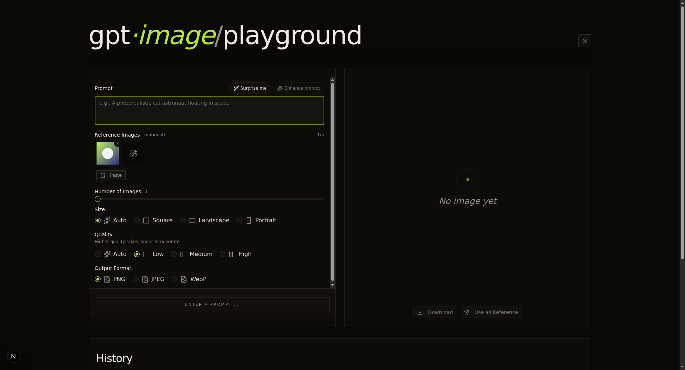
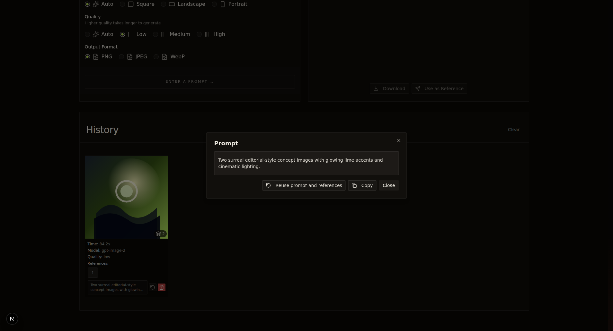

#  GPT Image Playground

A focused web playground for generating images with GPT Image models through the OpenAI SDK. It supports OpenAI-compatible Azure gateways, reference images, streaming previews, prompt enhancement, local history, cost estimates, and optional password protection.

<p align="center">
  
</p>

## Features

- **GPT Image generation:** Generate up to 5 images per request with `gpt-image-2`, `gpt-image-1.5`, `gpt-image-1`, or `gpt-image-1-mini`.
- **Reference-image workflow:** Drop, paste, upload, reuse, or send previous outputs back into the generator as visual references.
- **Streaming progress:** Image requests use an SSE path with keep-alives and optional partial-image previews so long generations do not leave the UI idle.
- **Prompt tools:** Use GPT-5.3 Chat to enhance prompts or generate a "Surprise me" idea, with optional reference-image context.
- **Output controls:** Choose count, size (`auto`, square, landscape, portrait), quality, output format (`png`, `jpeg`, `webp`), and compression for JPEG/WebP.
- **History and reuse:** Browse generated batches, open images in a lightbox, download selected images, reuse prompts, reuse prompts with references, and delete entries.
- **Cost estimates:** Store token usage and estimated USD costs per generation in local history.
- **Storage options:** Save generated images to the local filesystem by default, or use browser IndexedDB for serverless deployments.
- **Password protection:** Add `APP_PASSWORD` to require a shared password before API-backed operations.

<p align="center">
  
</p>

<p align="center">
  
</p>

<p align="center">
  
</p>

## Quick start

```bash
git clone https://github.com/illgitthat/gpt-image-playground.git
cd gpt-image-playground

cp .env.local.example .env.local
# Edit .env.local with your API credentials.

bun install
bun run dev
```

Open [http://localhost:3000](http://localhost:3000).

## Configuration

Create `.env.local` from `.env.local.example` and configure either OpenAI or an OpenAI-compatible Azure gateway.

### Standard OpenAI

```dotenv
OPENAI_API_KEY=sk-your-openai-api-key-here

# Optional: point the OpenAI SDK at a compatible endpoint.
# OPENAI_API_BASE_URL=https://your-custom-endpoint.com/v1
```

### Azure OpenAI-compatible gateway

```dotenv
AZURE_OPENAI_API_KEY=your-azure-api-key
AZURE_OPENAI_ENDPOINT=https://your-gateway.com/openai/v1
AZURE_OPENAI_DEPLOYMENT_NAME=gpt-image-2
```

The app uses the standard `openai` package, not the Azure SDK. For Azure-compatible endpoints, requests are authenticated with the `api-key` header and image generation is routed through the Responses API `image_generation` tool.

If `AZURE_OPENAI_DEPLOYMENT_NAME` is set to a concrete deployment alias that is not one of the built-in model IDs, the server sends that value in the `x-ms-oai-image-generation-deployment` header. If it is set to a built-in model ID, the selected UI model is used.

### Prompt enhancement

```dotenv
PROMPT_ENHANCE_MODEL=gpt-5.3-chat

# Optional Azure deployment override for prompt enhancement.
# AZURE_OPENAI_PROMPT_ENHANCE_DEPLOYMENT_NAME=gpt-5.3-chat
```

Prompt enhancement and "Surprise me" use the Responses API and include up to 5 reference images when available.

### Storage mode

```dotenv
# Options: fs or indexeddb
# NEXT_PUBLIC_IMAGE_STORAGE_MODE=fs
```

- `fs` stores generated outputs in `./generated-images` and serves them through `/api/image/[filename]`.
- `indexeddb` stores generated outputs in the browser. This is useful on read-only or ephemeral hosts.
- If storage mode is not set, Vercel deployments default to `indexeddb`; local development defaults to `fs`.
- Reference images are stored locally in IndexedDB for history reuse.

### Password protection

```dotenv
APP_PASSWORD=your-shared-password
```

When set, the UI asks users to configure the password and sends a SHA-256 hash with protected API requests.

## Development

```bash
bun install
bun run dev
```

Useful scripts:

| Command | Description |
| --- | --- |
| `bun run dev` | Start the Next.js development server with Turbopack. |
| `bun run build` | Build the production app. |
| `bun run start` | Start the production server after a build. |
| `bun run lint` | Run ESLint. |
| `bun run format` | Format source files with Prettier. |

## Production with systemd

Build the app, install the service file, and update the unit for your host:

```bash
bun install
bun run build
sudo cp ./deploy/gpt-image-playground.service /etc/systemd/system/
sudo systemctl daemon-reload
sudo systemctl enable gpt-image-playground
sudo systemctl restart gpt-image-playground
sudo systemctl status gpt-image-playground
```

In most deployments you should adjust the service user, working directory, Bun path, hostname, and port in `deploy/gpt-image-playground.service`.

If a reverse proxy or CDN fronts the app, use long upstream timeouts and disable proxy buffering for image-generation requests. The app streams image progress over SSE and long generations can run for several minutes.

## Notes

- The visible app is currently focused on image generation and reference-image editing workflows. Video/Sora code exists in the repository but the video UI is disabled.
- Keep API keys out of source control. `.env.local` is ignored by Git.
- Generated filesystem outputs are written to `generated-images/`; avoid committing generated user assets.

## License

MIT
