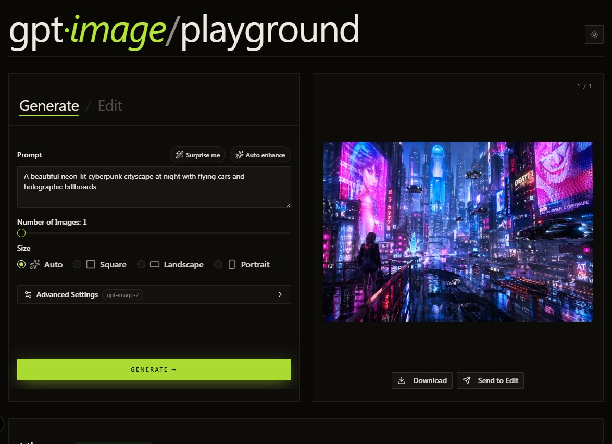
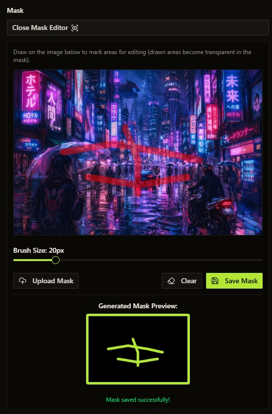
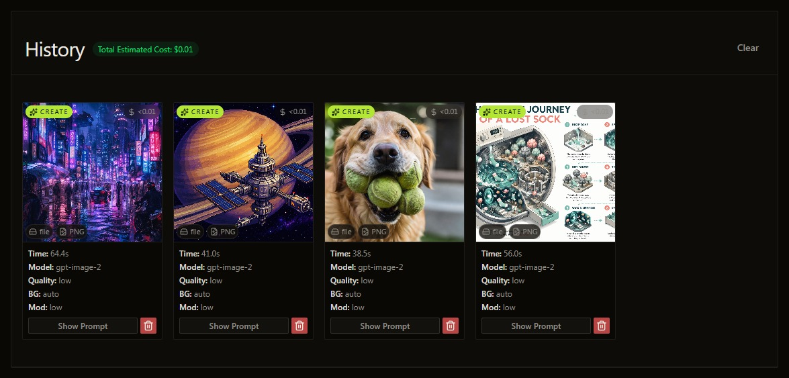
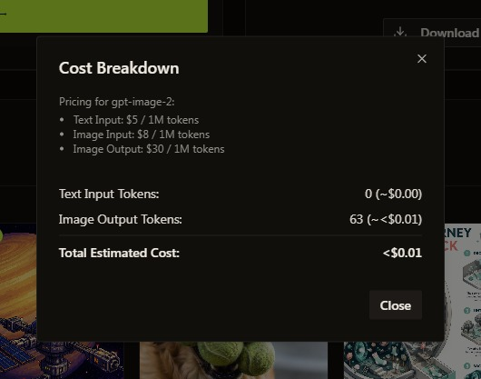
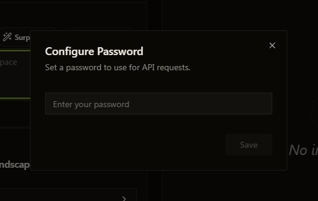

#  GPT Image/Video Playground

A web-based playground to interact with OpenAI's GPT image models (`gpt-image-2`, `gpt-image-1.5`, `gpt-image-1`, and `gpt-image-1-mini`) for generating and editing images, plus **Sora 2** for AI video generation. Supports both the standard OpenAI API and Azure OpenAI deployments.

> **Note:** The playground now defaults to `gpt-image-2`.

<p align="center">
  
</p>

## 📑 Table of Contents

- [ GPT Image/Video Playground](#-gpt-imagevideo-playground)
  - [📑 Table of Contents](#-table-of-contents)
  - [⚡ Quick Start](#-quick-start)
  - [✨ Features](#-features)
  - [▲ Deploy to Vercel](#-deploy-to-vercel)
  - [🚀 Local Deployment](#-local-deployment)
    - [Prerequisites](#prerequisites)
    - [1. Set Up API Key 🟢](#1-set-up-api-key-)
    - [🟡 Optional Configuration](#-optional-configuration)
    - [2. Install Dependencies 🟢](#2-install-dependencies-)
    - [3. Run the Development Server 🟢](#3-run-the-development-server-)
    - [4. Open the Playground 🟢](#4-open-the-playground-)
  - [🏭 Production Run (systemd)](#-production-run-systemd)
  - [🤝 Contributing](#-contributing)
  - [📄 License](#-license)

## ⚡ Quick Start

```bash
# 1. Clone and enter the repo
git clone https://github.com/illgitthat/gpt-image-playground.git
cd gpt-image-playground

# 2. Set up your environment variables
cp .env.local.example .env.local
# Then edit .env.local with your API key(s)

# 3. Install and run
bun install
bun run dev
```

Then open [http://localhost:3000](http://localhost:3000) 🎉

## ✨ Features

- **🎨 Image Generation Mode:** Create new images from text prompts.
- **🖌️ Image Editing Mode:** Modify existing images based on text prompts and optional masks.
- **🎞️ Image → Video (Sora 2):** Generate a short video from a prompt, optionally guided by a reference image, using OpenAI Sora 2.
- **⚙️ Full API Parameter Control:** Access and adjust relevant parameters supported by the OpenAI Images API directly through the UI (size, quality, output format, compression, background, number of images).
- **🎭 Integrated Masking Tool:** Easily create or upload masks directly within the editing mode to specify areas for modification. Draw directly on the image to generate a mask.

    <p align="center">
      
    </p>

- **📜 Detailed History & Cost Tracking:**
    - View a comprehensive history of all your image generations and edits.
    - See the parameters used for each request.
    - Get detailed API token usage and estimated cost breakdowns (`$USD`) for each operation. (hint: click the `$` amount on the image)
    - View the full prompt used for each history item.
    - View total historical API cost.
    - Delete items from history

<p align="center">
  
</p>

<p align="center">
  
</p>

- **🖼️ Flexible Image Output View:** View generated image batches as a grid or select individual images for a closer look.
- **🚀 Send to Edit:** Quickly send any generated or history image directly to the editing form.
- **📋 Paste to Edit:** Paste images directly from your clipboard into the Edit mode's source image area.
- **✨ Prompt Auto-Enhance:** Refine generate and edit prompts with GPT-5.3 Chat before sending them to the image API.
- **💾 Storage:** Supports two modes via `NEXT_PUBLIC_IMAGE_STORAGE_MODE`:
    - **Filesystem (default):** Images saved to `./generated-images` on the server.
    - **IndexedDB:** Images saved directly in the browser's IndexedDB (ideal for serverless deployments).
    - Generation history metadata is always saved in the browser's local storage.

## ▲ Deploy to Vercel

🚨 _CAUTION: If you deploy from `main` or `master` branch, your Vercel deployment will be **publicly available** to anyone who has the URL. Deploying from other branches will require users to be logged into Vercel (on your team) to access the preview build._ 🚨

You can deploy your own instance of this playground to Vercel with one click:

[](https://vercel.com/new/clone?repository-url=https://github.com/illgitthat/gpt-image-playground&env=OPENAI_API_KEY,NEXT_PUBLIC_IMAGE_STORAGE_MODE,APP_PASSWORD&envDescription=OpenAI%20API%20Key%20is%20required.%20Set%20storage%20mode%20to%20indexeddb%20for%20Vercel%20deployments.&project-name=gpt-image-playground&repository-name=gpt-image-playground)

You will be prompted to enter your `OPENAI_API_KEY` and `APP_PASSWORD` during the deployment setup. The app will automatically use `indexeddb` storage mode on Vercel.

## 🚀 Local Deployment

Follow these steps to get the playground running locally.

### Prerequisites

- [Node.js](https://nodejs.org/) (Version 20 or later required)
- [Bun](https://bun.sh/) (Version 1.3 or later recommended)

### 1. Set Up API Key 🟢

You need an API key to use this application. You can configure it to use either a standard OpenAI API key or an Azure OpenAI deployment.

> ⚠️ [Your OpenAI Organization needs to be verified to use GPT Image models](https://help.openai.com/en/articles/10910291-api-organization-verification)

**Option 1: Standard OpenAI API Key**

1.  If you don't have a `.env.local` file in the project root, create one.
2.  Add your OpenAI API key to the `.env.local` file:

    ```dotenv
    # .env.local
    OPENAI_API_KEY=your_openai_api_key_here
    ```

**Option 2: Azure OpenAI Service**

1.  Ensure you have an Azure OpenAI resource and a model deployment (for example, `gpt-image-2`).
2.  If you don't have a `.env.local` file in the project root, create one.
3.  Add your Azure OpenAI credentials and deployment details to the `.env.local` file:

    ```dotenv
    # .env.local
    AZURE_OPENAI_API_KEY=your_azure_api_key
    AZURE_OPENAI_ENDPOINT=your_azure_endpoint # e.g., https://your-resource-name.openai.azure.com/
    AZURE_OPENAI_DEPLOYMENT_NAME=gpt-image-2 # Or your custom image deployment name
    AZURE_OPENAI_API_VERSION=your_api_version # e.g., 2025-04-01-preview
    AZURE_OPENAI_SORA_MODEL=sora-2 # optional override for the Sora 2 deployment name
    ```

**How it Works:**

The application will automatically detect if the Azure environment variables (`AZURE_OPENAI_API_KEY`, `AZURE_OPENAI_ENDPOINT`, `AZURE_OPENAI_DEPLOYMENT_NAME`, `AZURE_OPENAI_API_VERSION`) are set in `.env.local`. If they are, it will use the Azure OpenAI client. Otherwise, it will fall back to using the standard OpenAI client if `OPENAI_API_KEY` is set.

On the Azure OpenAI-compatible gateway path used in this repo, image generation is currently routed through the Responses API image tool. In live testing against Azure, that path supports `auto`, `1024x1024`, `1536x1024`, and `1024x1536`.

> **Important:** Keep your API keys secret. The `.env.local` file is included in `.gitignore` by default.

### 🟡 Optional Configuration

<details>
<summary><strong>IndexedDB Mode</strong> (for serverless hosts like Vercel)</summary>

For environments where the filesystem is read-only or ephemeral, images can be stored in the browser's IndexedDB:

```dotenv
NEXT_PUBLIC_IMAGE_STORAGE_MODE=indexeddb
```

> **Note:** The app auto-detects Vercel and defaults to `indexeddb` mode. For local development, it defaults to `fs` (filesystem).

</details>

<details>
<summary><strong>Prompt Auto-Enhance</strong></summary>

Auto-polish prompts with a chat model before calling the image API:

```dotenv
# Override the chat model (default: gpt-5.3-chat)
PROMPT_ENHANCE_MODEL=gpt-5.3-chat

# For Azure, specify a chat deployment
AZURE_OPENAI_PROMPT_ENHANCE_DEPLOYMENT_NAME=your_chat_deployment
```

</details>

<details>
<summary><strong>Custom API Endpoint</strong></summary>

Use an OpenAI-compatible API endpoint:

```dotenv
OPENAI_API_BASE_URL=your_compatible_api_endpoint_here
```

</details>

<details>
<summary><strong>Password Protection</strong></summary>

```dotenv
APP_PASSWORD=your_password_here
```

When set, users must enter the password to access the playground.

<p align="center">
  
</p>

</details>

### 2. Install Dependencies 🟢

Navigate to the project directory in your terminal and install the necessary packages:

```bash
bun install
```

### 3. Run the Development Server 🟢

Start the Next.js development server:

```bash
bun run dev
```

### 4. Open the Playground 🟢

Open [http://localhost:3000](http://localhost:3000) in your web browser. You should now be able to use the gpt-image-2 Playground!

## 🏭 Production Run (systemd)

1. Install, build, and start the service:

```bash
bun install
bun run build
sudo cp ./deploy/gpt-image-playground.service /etc/systemd/system/   # or wherever you store it
sudo systemctl daemon-reload
sudo systemctl enable gpt-image-playground
sudo systemctl restart gpt-image-playground
sudo systemctl status gpt-image-playground
```

2. Manage the service:

```bash
sudo systemctl status gpt-image-playground
sudo journalctl -u gpt-image-playground -n 100 --no-pager
sudo systemctl restart gpt-image-playground
sudo systemctl stop gpt-image-playground
```

Notes:

- Ensure `.env.local` (or exported env vars) is available in the project root so Next.js can read it when systemd starts the process.

## 🤝 Contributing

Contributions are welcome!

## 📄 License

MIT
