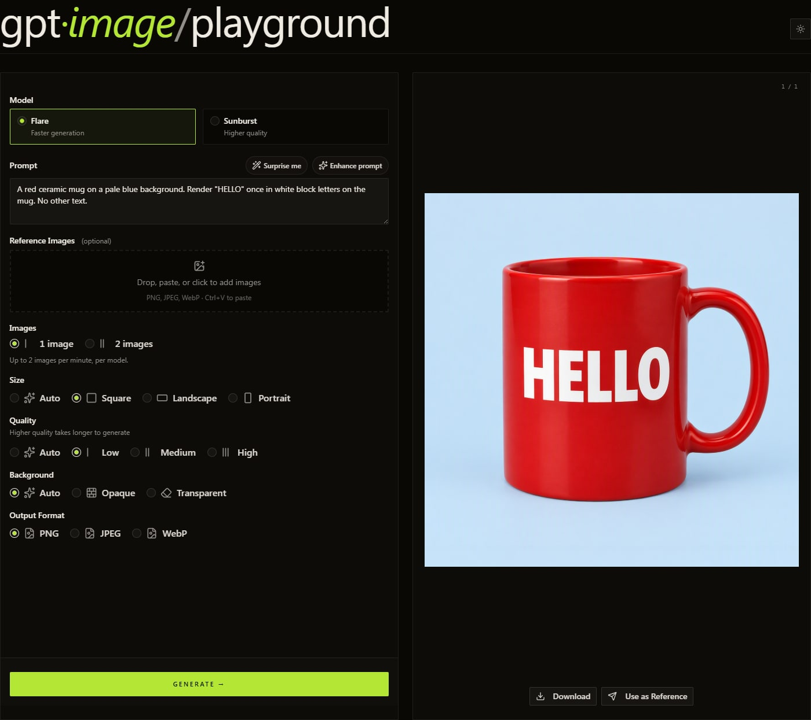
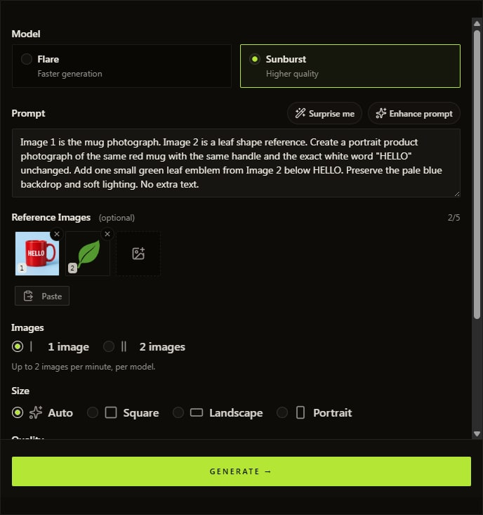
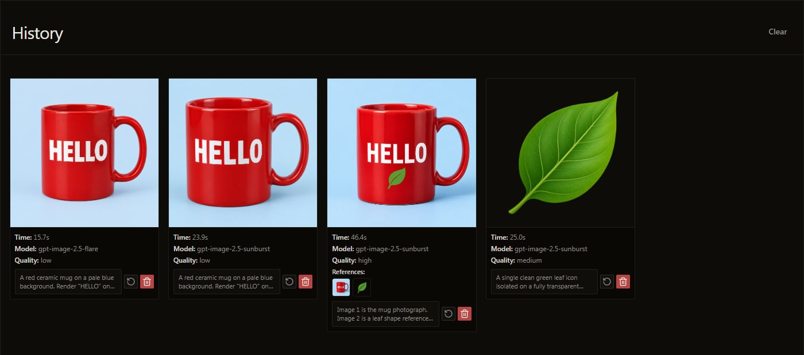
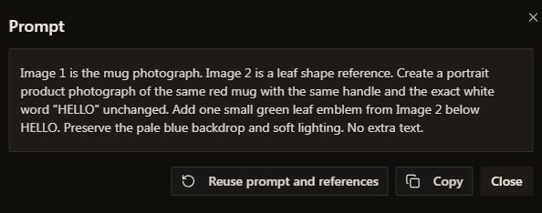

#  GPT Image Playground

A focused web playground for generating images with GPT Image models through the OpenAI SDK. It supports OpenAI-compatible Azure gateways, reference images, streaming previews, prompt enhancement, local history, cost estimates, and optional password protection.

<p align="center">
  
</p>

## Features

- **GPT Image 2.5:** Choose Flare (default, speed-focused) or Sunburst (quality-focused). Generate up to 2 images per batch.
- **Reference-image workflow:** Drop, paste, upload, reuse, or send previous outputs back into the generator as visual references. Numbered thumbnails match `Image 1`, `Image 2`, and so on in prompts.
- **Streaming progress:** Image requests use an SSE path with keep-alives and optional partial-image previews so long generations do not leave the UI idle.
- **Prompt tools:** Use `gpt-chat-latest` to enhance prompts or generate a "Surprise me" idea, with optional reference-image context.
- **Output controls:** Choose count, size (`auto`, square, landscape, portrait), quality, output format (`png`, `jpeg`, `webp`), and compression for JPEG/WebP.
- **History and reuse:** Browse generated batches, open images in a lightbox, download selected images, reuse prompts, reuse prompts with references, and delete entries.
- **Cost estimates:** Estimate image cost only when the API provides image-token usage. Text-orchestrator usage is not an image-cost estimate.
- **Storage options:** Save generated images to the local filesystem by default, or use browser IndexedDB for serverless deployments.
- **Password protection:** Add `APP_PASSWORD` to require a shared password before API-backed operations.

<p align="center">
  
</p>

<p align="center">
  
</p>

<p align="center">
  
</p>

## Quick start

Use Node.js 22.13 or later in the 22.x line, or Node.js 24 or later, and Bun.

```bash
git clone https://github.com/illgitthat/gpt-image-playground.git
cd gpt-image-playground

cp .env.local.example .env.local
# Edit .env.local with your API credentials.

bun install
bun run dev
```

Open [http://localhost:3000](http://localhost:3000).

## Configuration

Create `.env.local` from `.env.local.example` and configure either OpenAI or an OpenAI-compatible Azure gateway.

### Standard OpenAI

```dotenv
OPENAI_API_KEY=sk-your-openai-api-key-here

# Optional: point the OpenAI SDK at a compatible endpoint.
# OPENAI_API_BASE_URL=https://your-custom-endpoint.com/v1
```

### Azure OpenAI-compatible gateway

```dotenv
AZURE_OPENAI_API_KEY=your-azure-api-key
AZURE_OPENAI_ENDPOINT=https://your-gateway.com/openai/v1
```

The app uses the standard `openai` package, not the Azure SDK. For Azure-compatible endpoints, requests are authenticated with the `api-key` header and image generation is routed through the Responses API `image_generation` tool.

Deploy `gpt-image-2.5-flare` and `gpt-image-2.5-sunburst` at the same endpoint. The selected model is sent in the `x-ms-oai-image-generation-deployment` header. `AZURE_OPENAI_DEPLOYMENT_NAME` is no longer used; remove it from existing configurations. Older image models are not supported.

For this gateway, do not also send the model in the image tool: its validator rejects the new IDs even though the deployments work through the header. Standard OpenAI requests use the tool's `model` field.

### Model limits

The app allows 2 image requests per minute, per model, and at most 2 images per batch. Five-image live batches produced rate-limit failures on both deployments. The server reserves each batch against a rolling one-minute window and reports a wait time when the quota is full. It does not retry automatically. Successful images from a partially failed batch are kept.

The local quota guard applies to one server process. Other clients and server instances share the upstream quota; the gateway remains authoritative. Upstream `429` responses include the wait time when available.

The [OpenAI prompting guide](https://developers.openai.com/api/docs/guides/image-prompting) describes additional GPT Image 2.5 settings. Live tests of this gateway confirmed these narrower limits:

- Size: `auto`, `1024x1024`, `1536x1024`, or `1024x1536`. Custom 2K sizes are rejected. Returned pixel dimensions can differ from the requested preset; the app preserves the native output.
- Quality: `auto`, `low`, `medium`, or `high`. Extended quality settings are not exposed because the gateway rejects them.
- Background: `auto`, `opaque`, or `transparent`. Transparency requires PNG or WebP.
- Format: PNG and JPEG are generated directly. WebP is encoded locally from PNG because the gateway rejects direct WebP output. JPEG compression (0-100) is sent to the API; WebP compression (1-100) is applied locally.

See [prompt-guide.md](./prompt-guide.md) for concise prompting and output-review guidance.

### Prompt enhancement

```dotenv
AZURE_OPENAI_TEXT_MODEL=gpt-chat-latest
```

Prompt enhancement and "Surprise me" use the Responses API and include up to 5 reference images when available.

### Storage mode

```dotenv
# Options: fs or indexeddb
# NEXT_PUBLIC_IMAGE_STORAGE_MODE=fs
```

- `fs` stores generated outputs in `./generated-images` and serves them through `/api/image/[filename]`.
- `indexeddb` stores generated outputs in the browser. This is useful on read-only or ephemeral hosts.
- If storage mode is not set, Vercel deployments default to `indexeddb`; local development defaults to `fs`.
- Reference images are stored locally in IndexedDB for history reuse.

### Password protection

```dotenv
APP_PASSWORD=your-shared-password
```

When set, the UI asks users to configure the password and sends a SHA-256 hash with protected API requests.

## Development

```bash
bun install
bun run dev
```

Useful scripts:

| Command | Description |
| --- | --- |
| `bun run dev` | Start the Next.js development server with Turbopack. |
| `bun run build` | Build the production app. |
| `bun run start` | Start the production server after a build. |
| `bun run lint` | Run ESLint. |
| `bun run typecheck` | Check TypeScript types. |
| `bun test` | Run behavior tests without live API calls. |
| `bun run format` | Format source files with Prettier. |

Dependencies use current stable releases where compatible. ESLint stays on 9.x because the React lint plugin does not support ESLint 10; TypeScript stays on 6.0.x because typescript-eslint does not support TypeScript 7.

## Production with systemd

Build the app, install the service file, and update the unit for your host:

```bash
bun install
bun run build
sudo cp ./deploy/gpt-image-playground.service /etc/systemd/system/
sudo systemctl daemon-reload
sudo systemctl enable gpt-image-playground
sudo systemctl restart gpt-image-playground
sudo systemctl status gpt-image-playground
```

In most deployments you should adjust the service user, working directory, Bun path, hostname, and port in `deploy/gpt-image-playground.service`.

If a reverse proxy or CDN fronts the app, use long upstream timeouts and disable proxy buffering for image-generation requests. The app streams image progress over SSE and long generations can run for several minutes.

## Notes

- The visible app is currently focused on image generation and reference-image editing workflows. Video/Sora code exists in the repository but the video UI is disabled.
- Generated filesystem outputs are written to `generated-images/`; avoid committing generated user assets.

## License

MIT
