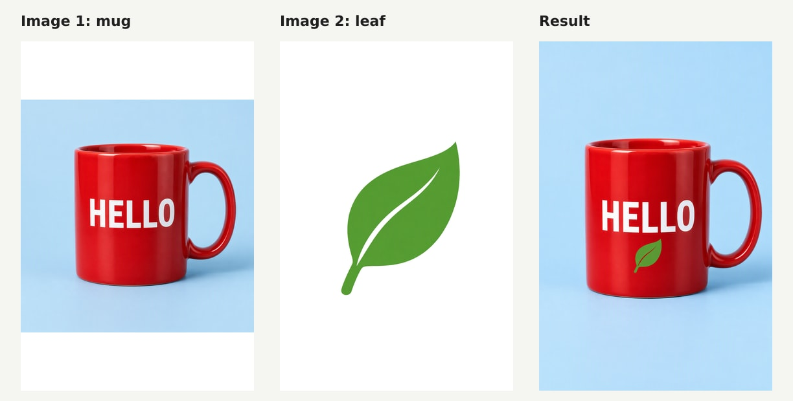

# GPT Image Playground

Generate and edit images with GPT Image 2.5 Flare and Sunburst, using reference images, prompt enhancement, and local history.


## Quick start

Use Node.js 24 LTS and [Bun](https://bun.sh).

```bash
git clone https://github.com/illgitthat/gpt-image-playground.git
cd gpt-image-playground
bun install
cp .env.local.example .env.local
```

Add your API configuration to `.env.local` using one of the options below, then run:

```bash
bun run dev
```

Open [localhost:3000](http://localhost:3000).

## Configuration

For the OpenAI API:

```dotenv
OPENAI_API_KEY=your-api-key
```

For an Azure-compatible gateway:

```dotenv
AZURE_OPENAI_API_KEY=your-api-key
AZURE_OPENAI_ENDPOINT=https://your-gateway.com/openai/v1
```

The gateway must support the `x-ms-oai-image-generation-deployment` header and have both image models deployed. This is a gateway integration, not a direct Azure OpenAI connection.

| Optional setting | Purpose |
| --- | --- |
| `AZURE_OPENAI_TEXT_MODEL` | Text model for image orchestration and prompt tools. Defaults to `gpt-chat-latest`; choose a model available at your endpoint. |
| `OPENAI_API_BASE_URL` | Custom base URL for OpenAI-compatible connections. |
| `APP_PASSWORD` | Require a shared password. |
| `NEXT_PUBLIC_IMAGE_STORAGE_MODE` | `fs` saves images in `generated-images/`; `indexeddb` saves them in the browser. Defaults to `fs` locally and `indexeddb` on Vercel. |

Reference images and history are stored in the browser. Use `indexeddb` on hosts without persistent writable storage.

## Using the playground

Choose **Flare** for faster generation or **Sunburst** for higher quality. Enter a prompt, select your output settings, and generate. You can download results or reuse them as references.

For edits, add images by dropping, pasting, or uploading them. Refer to them by number and state what should change:

> Add the leaf from Image 2 below "HELLO" on the mug in Image 1. Preserve the mug, lettering, and pale blue background.



**Enhance prompt** refines your wording; **Surprise me** creates an idea. Use Undo to restore the previous prompt. History lets you reuse a prompt together with its references.

### Current limits

The app allows **2 images per batch** and **2 requests per minute, per model**. These are app limits, not provider limits. They are hardcoded in [`src/lib/image-options.ts`](./src/lib/image-options.ts); there is no environment setting to change them.

Size controls are limited to auto, square, landscape, and portrait; quality controls offer auto, low, medium, and high. The models support additional settings, but this integration does not expose them. See the [OpenAI image guide](https://developers.openai.com/api/docs/guides/image-prompting) for model capabilities and [prompt-guide.md](./prompt-guide.md) for prompting advice.

## Development

| Command | Purpose |
| --- | --- |
| `bun run dev` | Start the development server. |
| `bun run typecheck` | Check application and test types. |
| `bun run lint` | Run ESLint. |
| `bun test` | Run tests without paid API calls. |
| `bun run format` | Format source files. |

Pull requests run type checks, lint, tests, and a production build.

## Deployment

```bash
bun run build
bun run start
```

An example [systemd service](./deploy/gpt-image-playground.service) is included. Adjust its user, working directory, and Bun path for your host.

For a reverse proxy, allow long-running requests and disable response buffering so image previews can stream.

## License

[MIT](./LICENSE)
